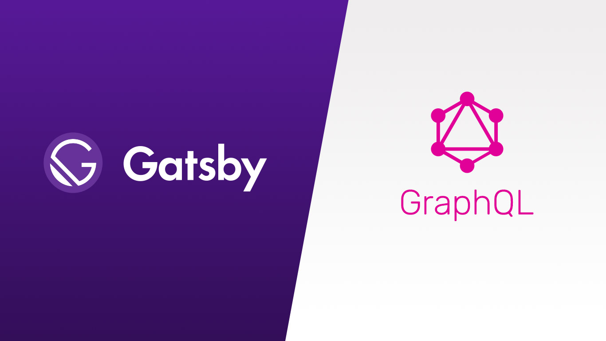

In the modern web development landscape, the ability to efficiently manage and query data is crucial. Gatsby leverages GraphQL to provide a powerful data layer that makes integrating various data sources into your React applications both seamless and efficient.

## Understanding GraphQL in Gatsby



GraphQL is a query language for APIs and a runtime for executing those queries with your existing data. Gatsby uses GraphQL to enable developers to access and manipulate data from multiple sources in a consistent and efficient way.

### Benefits of Using GraphQL with Gatsby

-   **Unified Data Layer**: Consolidate data from different sources (CMSs, APIs, databases) into a single GraphQL layer.
-   **Optimized Queries**: Fetch only the data you need, reducing the overhead of over-fetching associated with traditional REST APIs.
-   **Data Agnostic**: Integrate any data source, from Markdown files to headless CMSs, without worrying about underlying data structures.

## Integrating GraphQL with Gatsby

Let's explore how to set up and utilize Gatsby's GraphQL data layer in a React application.

### Step 1: Set Up a Gatsby Project

If you haven’t already, create a new Gatsby project:

```bash
gatsby new my-gatsby-graphql-site
cd my-gatsby-graphql-site
gatsby develop
```
