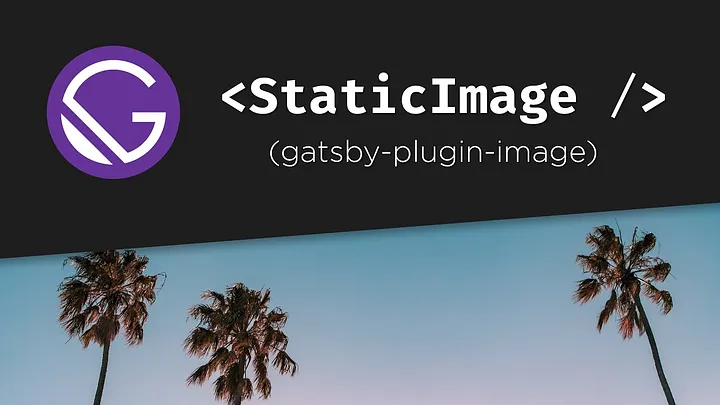

When building modern web applications, performance is a critical factor that can significantly affect user experience and SEO rankings. React, combined with Gatsby, provides powerful tools and techniques to optimize web applications, making them faster and more efficient.

## The Power of Gatsby for Optimization



Gatsby offers several built-in features that enhance the performance of React applications:

-   **Static Site Generation (SSG)**: Gatsby pre-renders pages at build time, resulting in faster load times and better SEO.
-   **Code Splitting**: Automatically splits code into smaller bundles, loading only the necessary parts for each page.
-   **Lazy Loading**: Images and other assets are loaded only when needed, reducing initial load time.
-   **Image Optimization**: Gatsby optimizes images for different devices and screen sizes, ensuring they load quickly and look great.

## Implementing Performance Enhancements

Let's explore some practical ways to optimize a React application using Gatsby.

### Step 1: Use Gatsby's Image Component

Gatsby's `<GatsbyImage />` component is a powerful tool for image optimization. It automatically generates responsive images and lazy-loads them for better performance.

First, install the necessary plugins:

```bash
npm install gatsby-plugin-image gatsby-plugin-sharp gatsby-transformer-sharp
```
