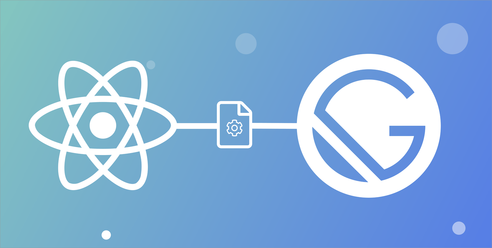

React has become one of the most popular frameworks for building user interfaces, and when combined with Gatsby, it offers a powerful solution for creating fast, scalable, and modern web applications.

## Why Choose React?



React is a JavaScript library developed by Facebook, designed to build interactive user interfaces efficiently. Some key features include:

-   **Component-Based Architecture**: React breaks the UI into reusable components, making it easier to manage and scale applications.
-   **Virtual DOM**: React updates only the necessary parts of the DOM, leading to improved performance.
-   **Rich Ecosystem**: A vibrant community and a vast ecosystem of libraries and tools make development faster and more efficient.

## Enter Gatsby

Gatsby is a React-based framework that specializes in static site generation. It allows developers to build blazing-fast websites with pre-rendered HTML and JavaScript. Here’s why Gatsby stands out:

-   **Performance**: Gatsby automatically optimizes images, code, and assets to ensure the fastest load times.
-   **SEO-Friendly**: Pre-rendered HTML ensures search engines can crawl your content effectively.
-   **Data Integration**: Gatsby seamlessly integrates with data sources like CMSs, APIs, and databases through its GraphQL data layer.
-   **Progressive Web App (PWA)**: Gatsby sites come with built-in PWA features, such as offline support and fast page transitions.

## Building a Gatsby Site

Let's dive into creating a simple Gatsby site to understand how easy and powerful it is to work with.

### Step 1: Set Up Your Environment

First, ensure you have Node.js and npm installed. Then, install the Gatsby CLI:

```bash
npm install -g gatsby-cli
```
